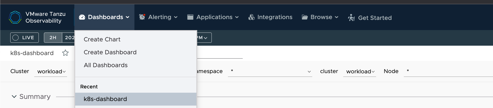
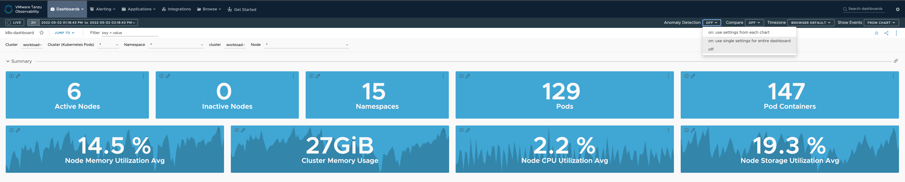
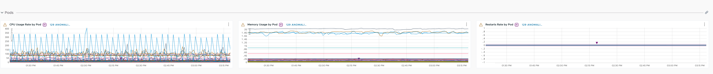
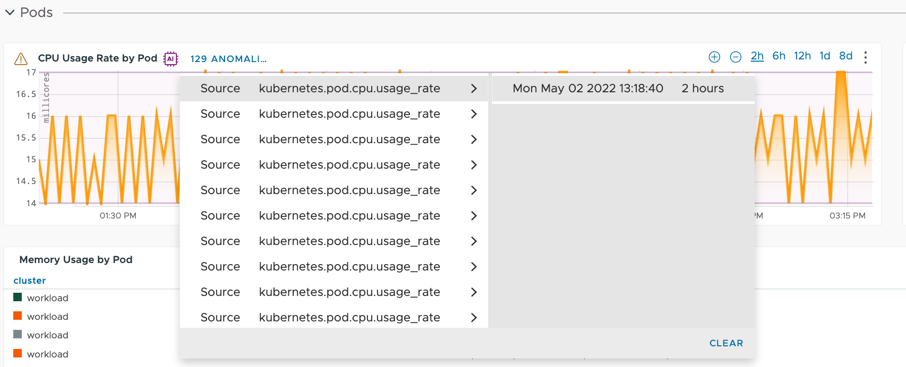
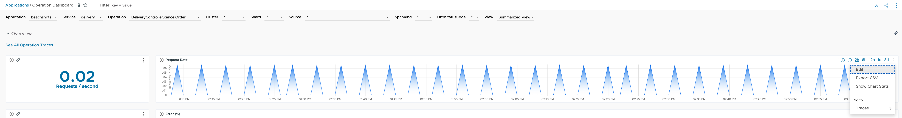
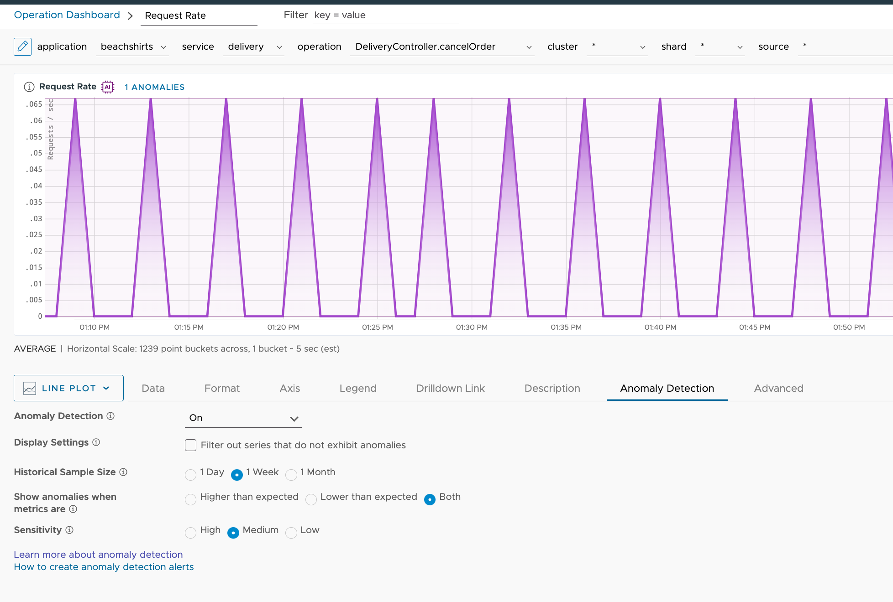
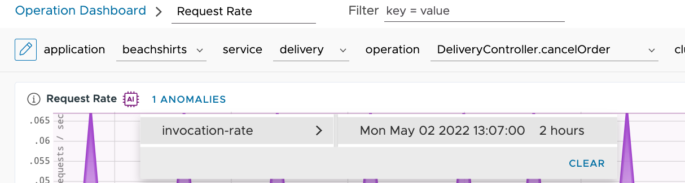

### 대시보드에서 Anomaly Detection 적용
기존 대시보드에서 Anomaly Detection 기능을 사용할 수 있습니다.  
상단 Dashboard 메뉴에서 원하는 대시보드를 선택합니다. 예시에서는 사전에 생성한 k8s-dashboard를 선택했습니다.  

대시보드로 들어오면 상단에 Anomaly Detection이 off (디폴트 값) 되어 있습니다. 이를 On으로 변경합니다.  
Lab에서는 전체 대시보드에 대해 세팅을 적용해 보겠습니다.

적용 후, Line Chart들에 Anomaly가 추가된 것을 확인합니다. 

가장 왼쪽 차트로부터 자세한 Anomaly 정보를 확인해 보겠습니다. 아래 그림과 같이, Anomaly가 발생한 시간과 함께 그래프가 Highlight 표시됩니다. 

### 대시보드 편집 기능에서 Anomaly Detection 사용
Operation Dashboard에서 Line Chart를 하나 선택합니다.  
현재 Anomaly Detection은 Line Plot 차트에서 수행 가능합니다. 예시에서는 Operation Dashboard에서 Request Rate 차트를 선택했습니다  

차트 edit을 클릭해서 들어오면, 메뉴에 Anomaly Detection을 확인하실 수 있습니다. 기본 설정은 off이고, on으로 변경시 anomaly detection 기능이 적용됩니다.  

해당 차트에는 1개의 anomaly가 발생했는데, 클릭해서 해당 정보 확인이 가능합니다.  

상단 save버튼을 클릭해 새로운 대시보드로 저장할 수 있습니다.
  

Anomaly Detection Lab을 정상적으로 완료하셨습니다.