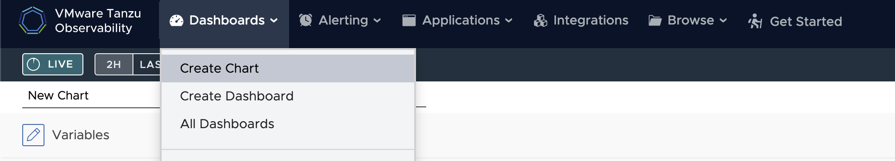
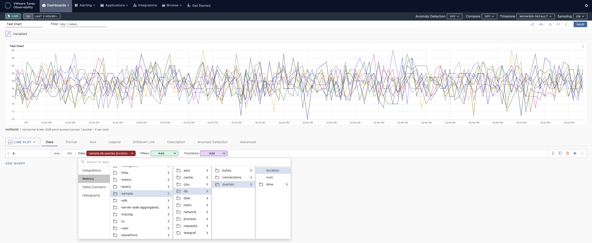
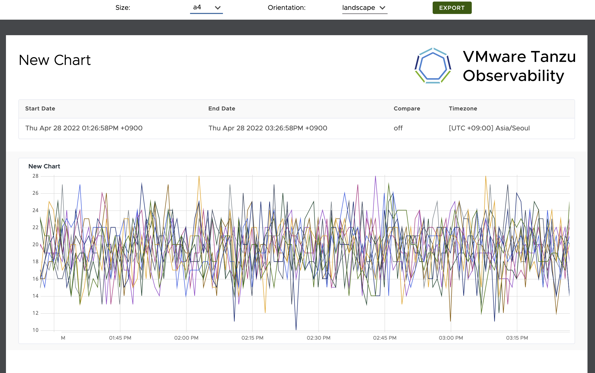

## 차트 생성 및 customizing

### 1. 차트 생성
Tanzu Observability 상단 메뉴에서 Create Chart를 클릭합니다.  

- 차트 이름을 설정합니다.
- 원하는 metric을 고르고, filter와 function을 설정합니다.

### 2. 차트 저장 및 export
- 오른쪽 상단에서 'save'를 클릭해 저장합니다. 

- save 대신 왼쪽 점을 클릭해 PDF/CSV로 export 가능합니다. 

