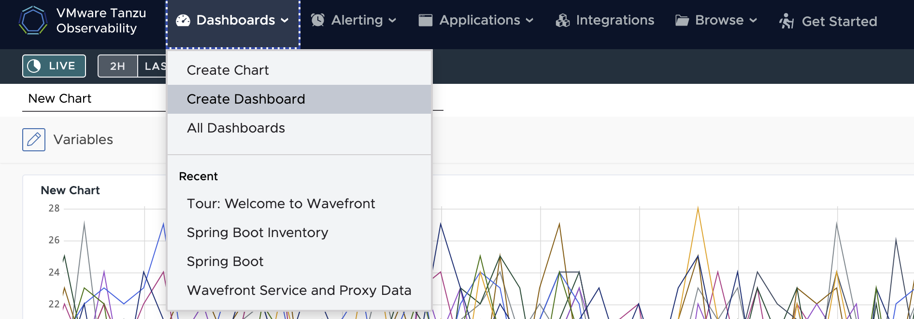
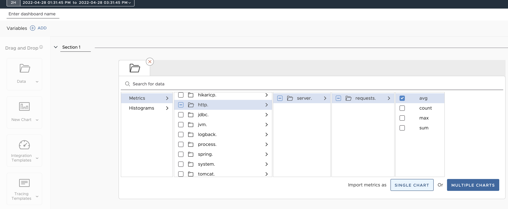
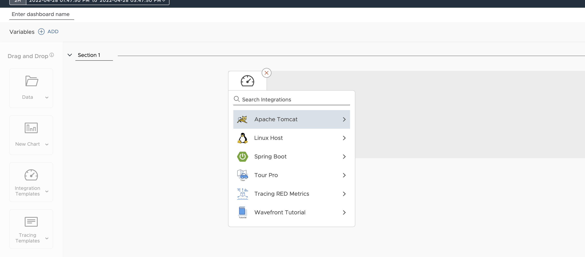
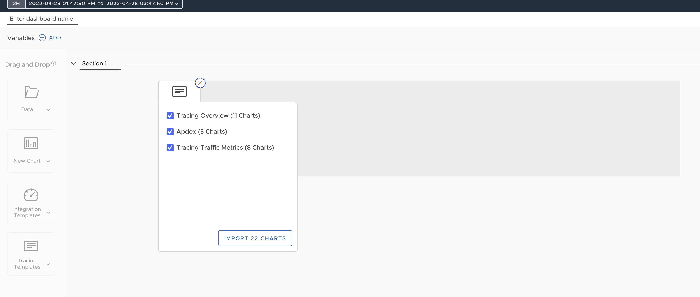

## 대시보드 생성 및 customizing

### 1. 대시보드 메뉴 접근
Tanzu Observability 상단 메뉴에서 Create Dashboard를 클릭합니다.  

### 2. 메트릭 데이터나 차트로부터 대시보드 생성
- 데이터나 새로운 차트 위젯을 캔버스로 drag & drop 합니다.
- 메트릭, 필터, function을 선택합니다.   메트릭 import시, single chart/multiple charts 선택이 가능합니다.
  
- 오른쪽 상단에서 Save를 클릭하고, 이름과 URL을 설정합니다.

### 3. Integration 템플릿으로부터 대시보드 생성
- Integration 템플릿을 캔버스로 drag & drop 합니다.
- source integration을 설정 후 대시보드를 생성합니다.
  

### 4. Tracing 템플릿으로부터 대시보드 생성
- Tracing 템플릿 위젯을 캔버스어 drag & drop 합니다.
- import할 차트를 선택합니다.
  

### 5. 생성된 대시보드 수정

### 6. 대시보드 삭제 및 복구

