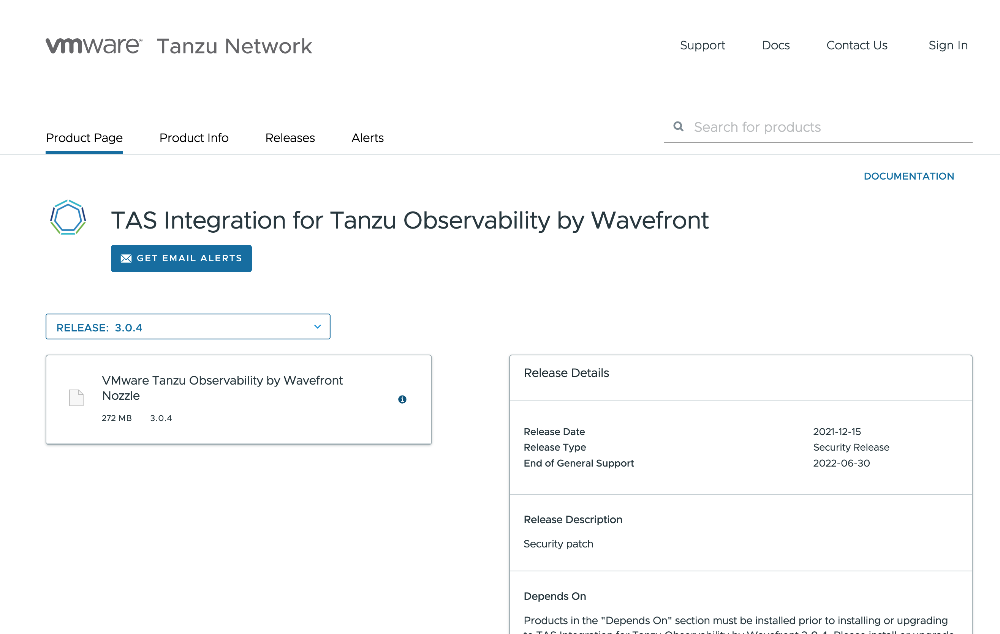
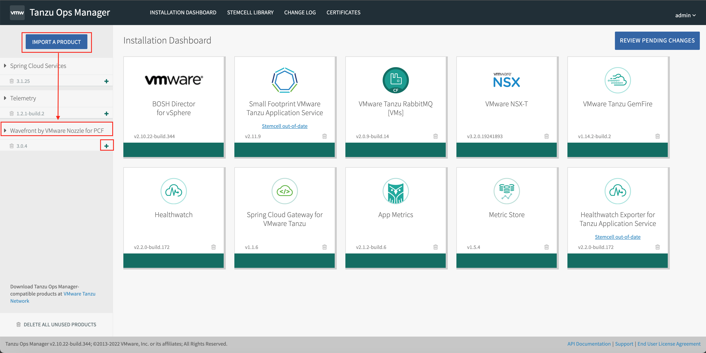
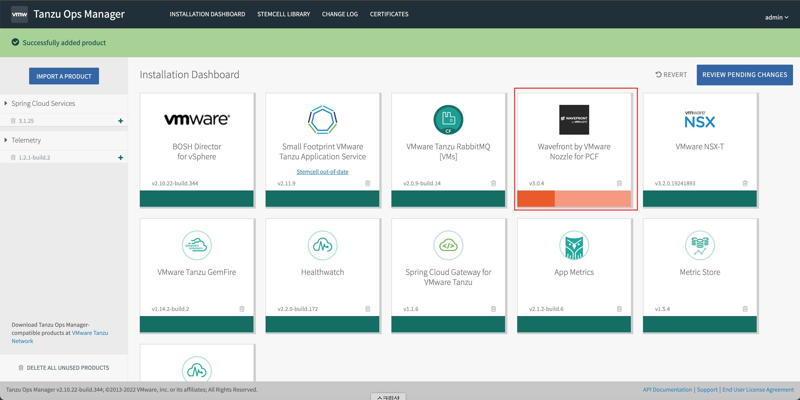
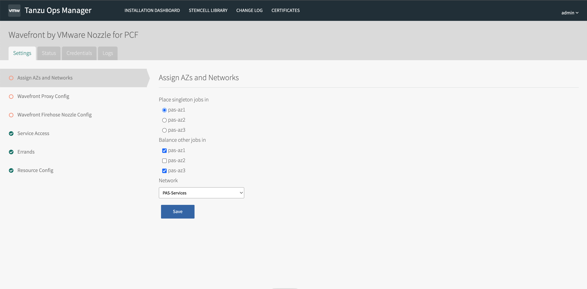
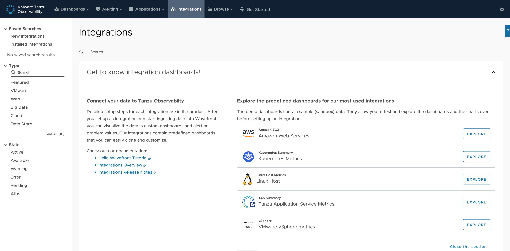
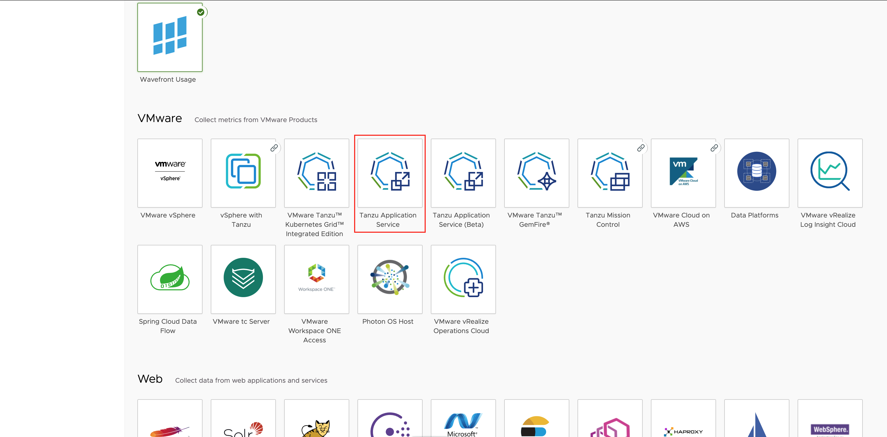

## Prerequisites
* Spring Boot 2.3.0 이상
* Java 8이상
* Maven 3.3이상 or Gradle 6.3이상

## Sample App Clone
**1.Spring Boot 기반 App Download**
~~~
git clone https://github.com/spring-projects/spring-petclinic.git
~~~

**2. Project 빌드 및 시작**
~~~
cd spring-petclinic
./mvnw spring-boot:run
~~~
여기까지 진행 후 localhost:8080으로 접근 시 다음 화면이 나타나면 빌드 성공입니다

## TO에 데이터 전송
**1. pom.xml에 dependency추가**
~~~
<dependency>
   <groupId>com.wavefront</groupId>
   <artifactId>wavefront-spring-boot-starter</artifactId>
 </dependency>
 ~~~
 
 **2. Spring Boot용 Wavefront BOM(Bill of Materials)에 대한 dependency 추가** 
 다음 코드를 pom.xml 파일에 추가합니다.  
 ~~~
 <dependencyManagement>
 <dependencies>
   <dependency>
     <groupId>com.wavefront</groupId>
     <artifactId>wavefront-spring-boot-bom</artifactId>
     <version>VERSION</version>
     <type>pom</type>
     <scope>import</scope>
   </dependency>
 </dependencies>
 </dependencyManagement>
 ~~~
 
 wavefront version의 경우, Spring Boot와의 Compatibility 참고가 필요합니다.
 

 
**3. Spring Cloud Sleuth 또는 OpenTracing을 사용을 위한 Dependency 추가** 
Spring Cloud Sleuth 또는 OpenTracing을 사용하여 Wavefront에 추적 데이터를 보내려면 다음 종속성을 추가해야 합니다  
**1) Slueth**   
pom.xml에 다음 코드 추가   
~~~
<dependency>
  <groupId>org.springframework.cloud</groupId>
  <artifactId>spring-cloud-starter-sleuth</artifactId>
</dependency>
~~~
~~~
<dependencyManagement>
<dependencies>
.....
<dependency>
<groupId>org.springframework.cloud</groupId>
<artifactId>spring-cloud-dependencies</artifactId>
<version>VERSION</version>
<type>pom</type>
<scope>import</scope>
</dependency>
.....
</dependencies>
</dependencyManagement>
~~~
**2) OpenTracing**    
pom.xml에 다음 코드 추가   
~~~
<dependency>
  <groupId>io.opentracing.contrib</groupId>
  <artifactId>opentracing-spring-cloud-starter</artifactId>
  <version>0.5.7</version>
</dependency>
~~~

**4. token,uri / proxy 정보 확인 및 설치**
 
token 및 Uri 정보는 TO 사이트에서 확인 가능합니다 
**1) https://longboard.wavefront.com/ 접속 -> 상단 Integration 클릭 -> Spring Boot 검색**

**2) Spring Boot 클릭 후, Setup 정보 확인** 

**Option 1. Direct Ingestion of Metrics **

위 코드를 복사해 application.properties에 붙여넣기 합니다. 

**Option 2. Wavefront Proxy 생성 및 App에 Proxy 등록 **
**1) Wavefront Proxy를 설치합니다. **
    - 다음 링크 참고 : https://longboard.wavefront.com/proxies/add   
**2)코드를 복사해 application.properties에 붙여넣기 합니다.** 

**5. Application Dashboard 확인**  
앱을 동작시킨 후, Tanzu Observability에 들어가 Applications -> Service Dashboard를 클릭하면 실시간으로 현황을 볼 수 있습니다. 

