## Prerequisites
* TAS(Tanzu Application Service) v2.9 이후

## TAS - TO 연동
### 1. Wavefront Nozzle Tile 다운로드
TAS는 Application 관리를 Tile을 통해서 하고 있습니다. 먼저 아래의 주소에서 nozzle tile을 다운로드 받습니다.
https://network.pivotal.io/products/wavefront-nozzle

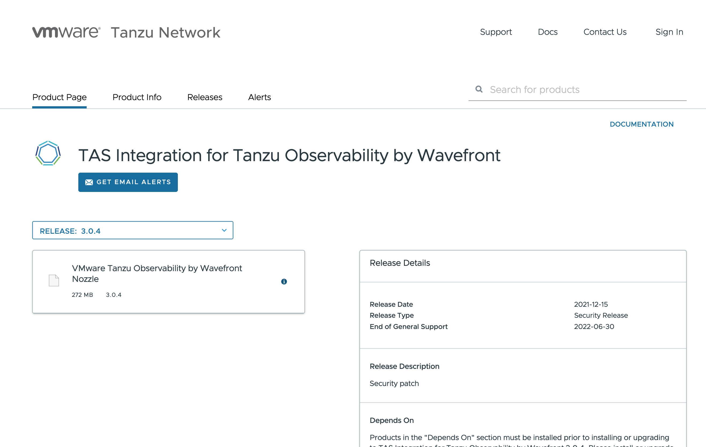

### 2. TAS Ops Manager에 로그인
TAS 환경의 Ops Manager에 로그인을 합니다. 

### 3. TAS에 Nozzle Tile 설치
Ops Manager에 로그인을 한 후 좌측 상단의 'Import  A Product'를 눌러 위에서 다운로드 받은 nozzle 파일(wavefront-nozzle-3.0.4.pivotal)을 선택하면 아래와 같이 'Wavefront by Vmware Nozzle for PCF' 가 생성이 됩니다. 바로 아래의 + 버튼을 클릭합니다.
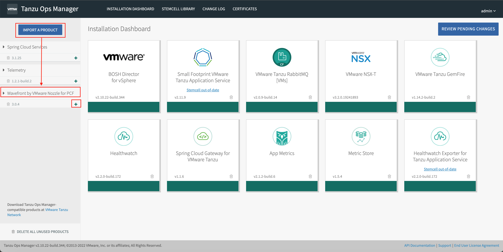

### 4. Nozzle Tile 설정하기
오른쪽의 카드 형태로 새로 생성된 'Wavefront by VMware Nozzle for PCF' 를 클릭합니다.
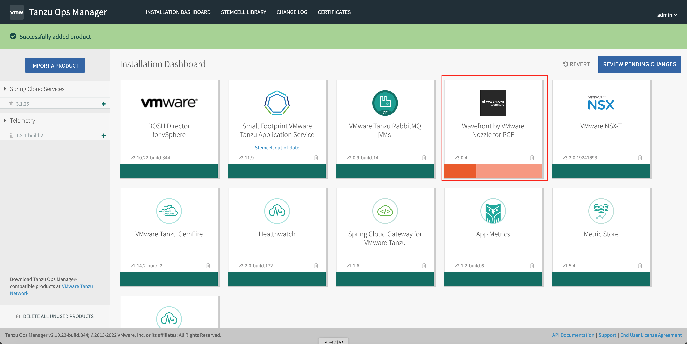

### 5. Nozzle Tile 설정하기 - 네트워크
사용하고 있는 vSphere의 AZ와 Network를 선택합니다. HA를 위해서 Balance other jobs는 모두 선택합니다. 이때 주의할 점은 Network 선택시에 해당 Network는 public network로 outbound 접속이 가능해야 합니다.
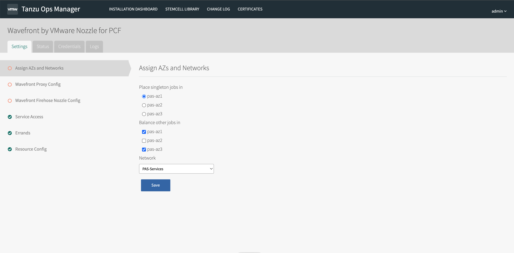

### 6. Nozzle Tile 설정하기 - TO 정보 입력
다음 단계는 TO의 정보를 입력하는 단계입니다. TO 대쉬보드 환경으로 이동합니다. 메뉴에서 Integration을 선택합니다.
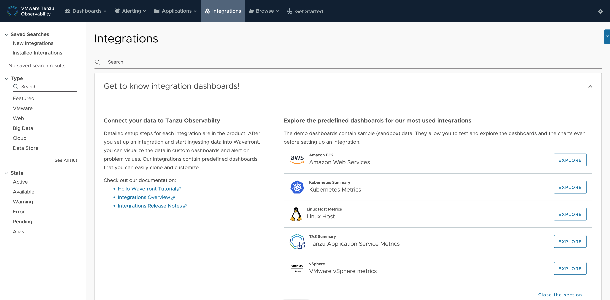

아래쪽으로 내리면 Tanzu Application Service가 보입니다. 이 메뉴를 클릭합니다.

여기에서 Setup을 클릭하면 다음과 같이 URL 과 API Token 값이 보이게 됩니다. 이 두 값을 복사해  놓습니다.
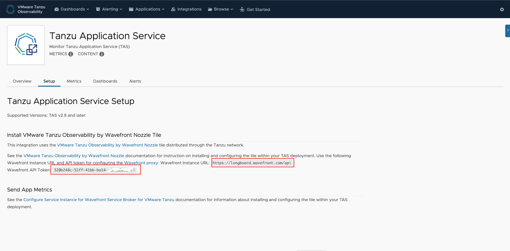
다시 TAS의 Ops Manager 화면으로 이동합니다. 위에서 복사한 URL과 API Token값을 입력합니다.
hostname은 적당한 값으로 입력하고, Quota Name에는 cf cli가 동작하는 환경에서 'cf quotas'를 실행해서 전체 Quota 목록을 확인합니다. 그 중에서 가장 많은 Quota를 선택합니다. default값은 runaway 입니다.
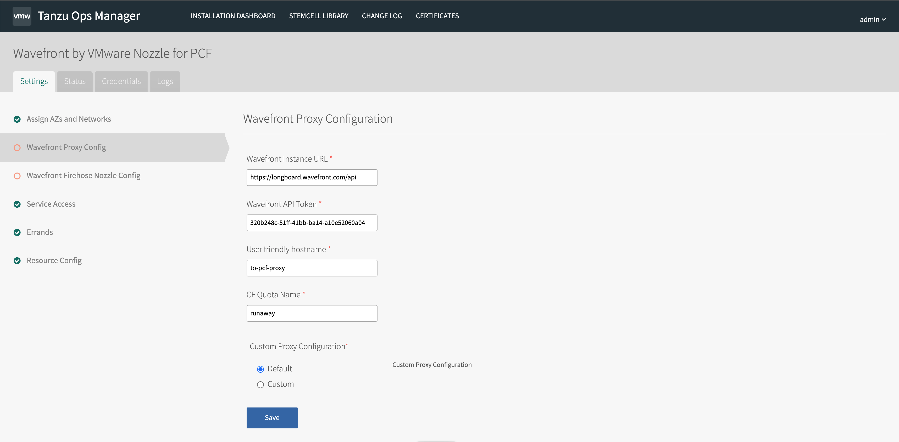

### 6. Nozzle Tile 설정하기 - TO에 보여질 이름 설정
다음으로 'Wavefront Firehose Nozzle Config' 탭으로 이동해서 Foundation(인스턴스) 이름을 적절히 입력합니다. TO 화면에서 보여지게 됩니다.
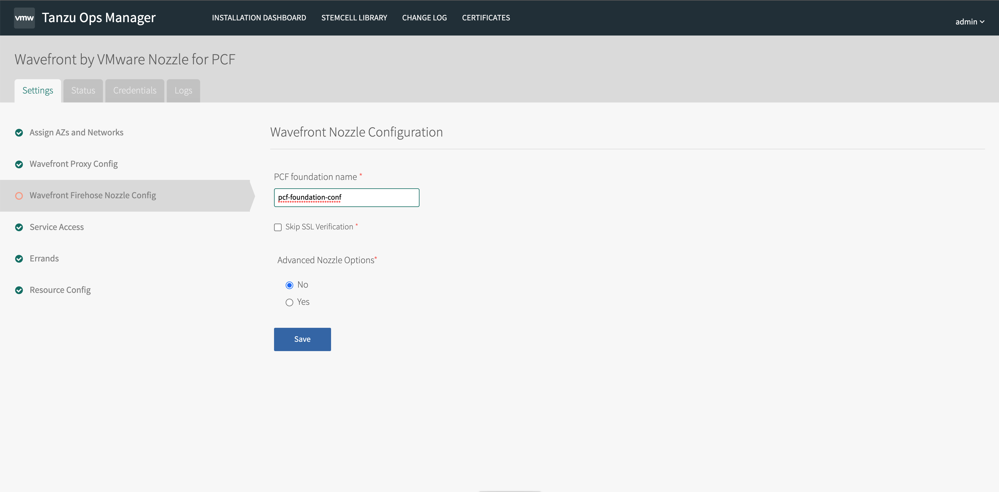

### 6. Nozzle Tile 설정하기 - Proxy VM 정보 확인
마지막으로 Resource Config 탭을 클릭하면 생성될 wavefront_proxy 인스턴스 VM의 정보가 보여지게 됩니다. 여기에서는 2cpu, 4GB의 ram으로 생성이 되는 것을 확인할 수 있습니다.
모든 metric 정보는 proxy에 수집이 된 후 TO로 전달이 되게 됩니다.
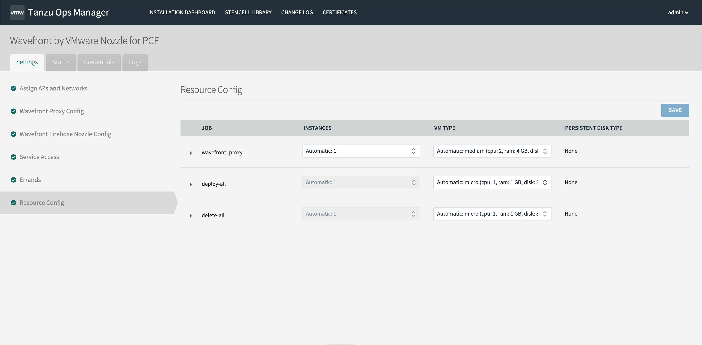

### 7. 변경 내용 반영하기
상단메뉴에서 Installation Dashboard를 선택해서 메인 화면으로 이동한 후에 오른쪽 REVIEW PENDING CHANGES 를 클릭합니다.
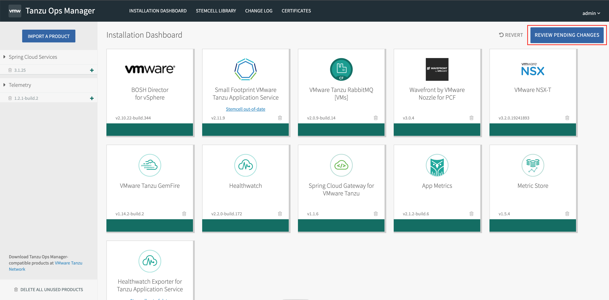

Review Page가 나오게 되면 새로 설치된 Wavefront가 보이게 되는데, 이때 바로 Apply Changes를 누르지 말고, Select All Products를 한번 클릭해서 모두 선택해제 시킵니다. 그리고 wavefront만 선택한 후에 Apply Changes를 클릭합니다.

`` ** 주의 : 모두 선택되어 있는 상태에서 Apply Changes를 누를 경우 1시간 이상 소요되게 되며, 기존 시스템에 영향이 있을 수 있으므로 반드시 선택해제를 합니다.
``
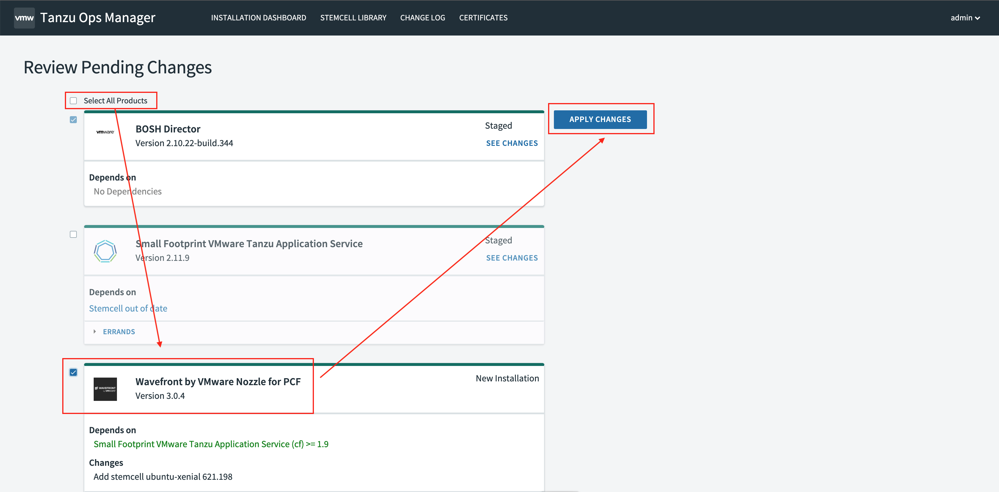

Tile이 설치되는데는 10분 정도의 시간이 소요됩니다.
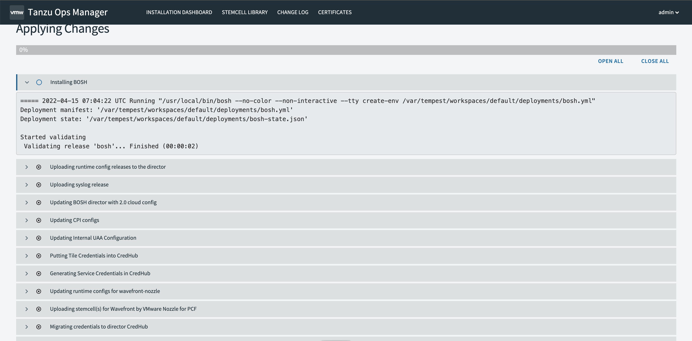

### 8. TO Dashboard 화면 확인하기
TO의 Tanzu Application Service 화면으로 이동한 후 위쪽에 METRICS와 CONTENT의 옆에 녹색 체크 버튼이 표시되어 있으면 정상적으로 연동이 된 것을 의미합니다. 만약 이 표시가 나오지 않을 경우 선택한 네트워크 대역에서 outbound 로 데이터가 정상적으로 전송이 되는지 확인이 필요합니다.
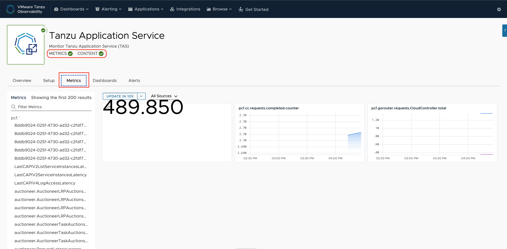

Dashboard 탭으로 이동하면 기본적으로 제공하고 있는 Dashboard들을 확인할 수 있습니다.
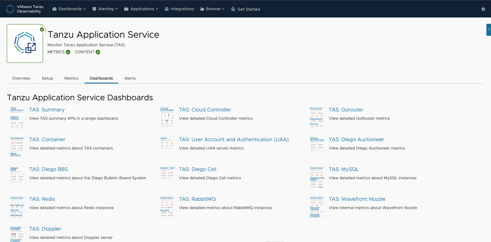

TAS Summary
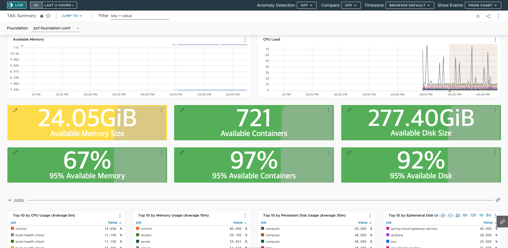

TAS Container
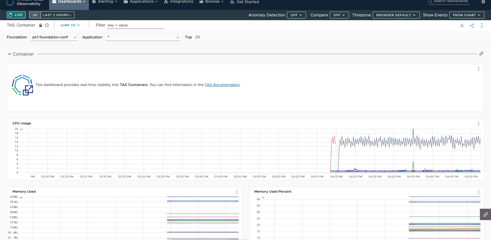

TAS 연동 Lab을 정상적으로 완료하셨습니다.