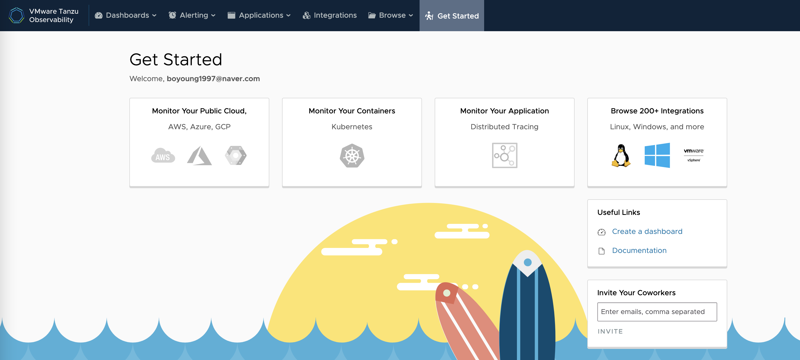
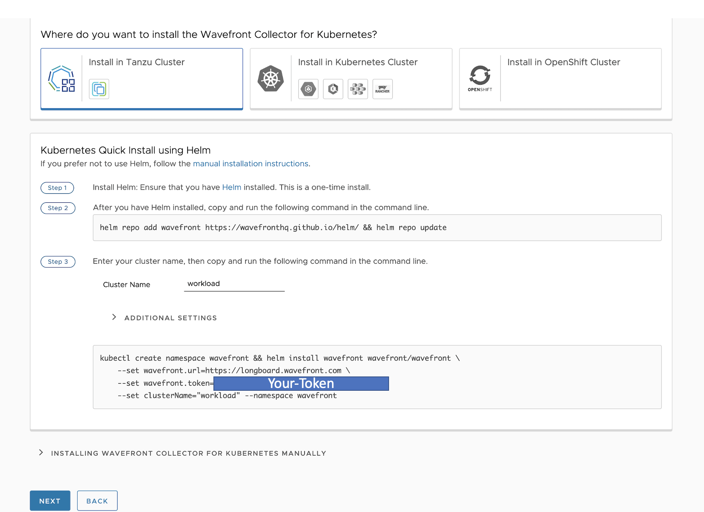
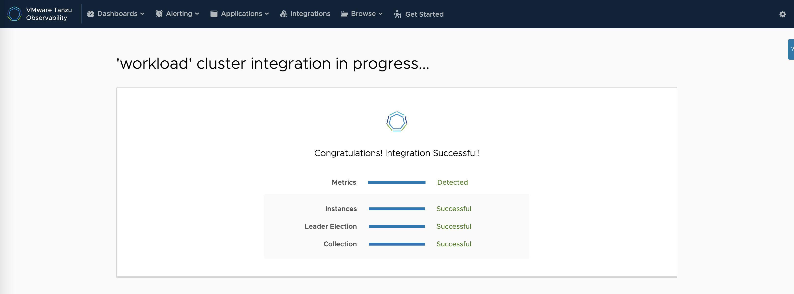

## Prerequisites
* Kubernetes 환경
* Helm 3

## 연동 방법
### 1.Tanzu Observability 사이트에 접속합니다.
Monitor Your Containers 에서 Kubernetes를 선택합니다.

### 2. Tanzu Cluster에 Wavefront Collector 설치
Install in Tanzu Cluster 를 클릭하면, 아래 Helm을 이용한 Quick Install 가이드가 나옵니다.  
가지고 있는 Tanzu Cluster 이름을 입력 후, 아래 명령어를 복사해 터미널에서 실행하고 아래 Next 버튼을 클릭합니다. 

Cluster Integration이 성공적으로 완료되면 상태가 successful로 표시됩니다.

 

Kubernetes 연동 Lab을 정상적으로 완료하셨습니다.