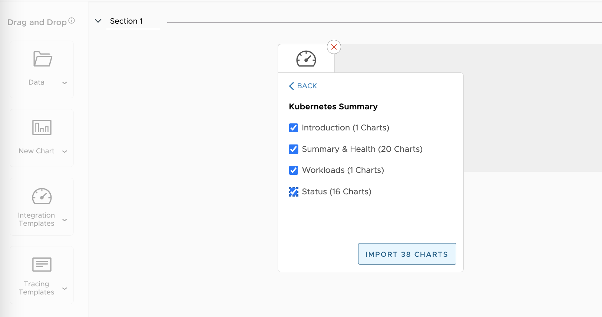
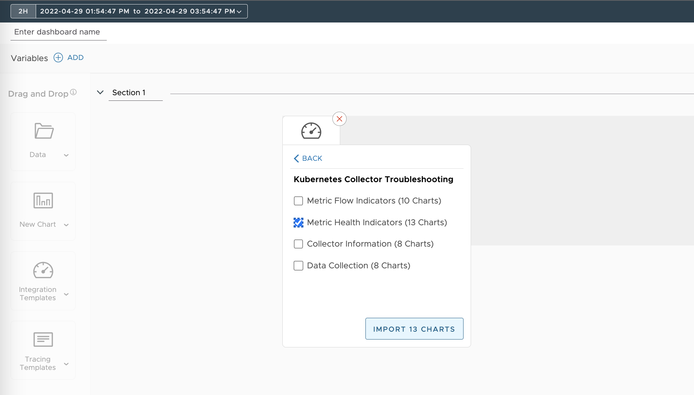
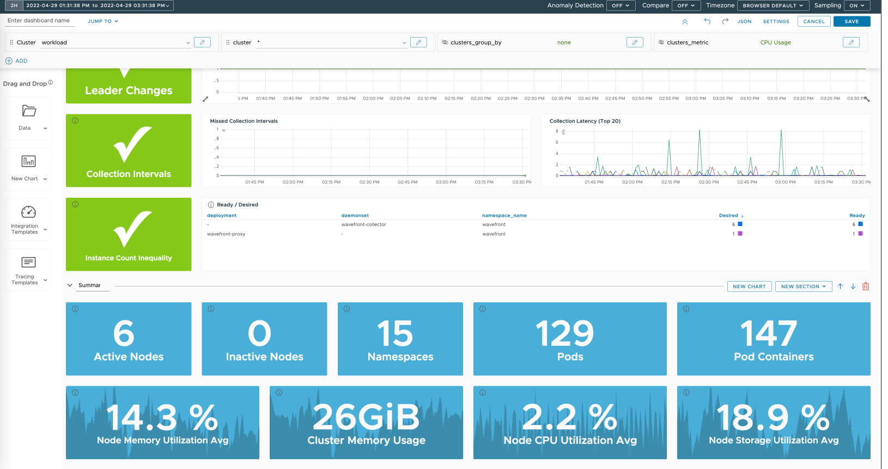
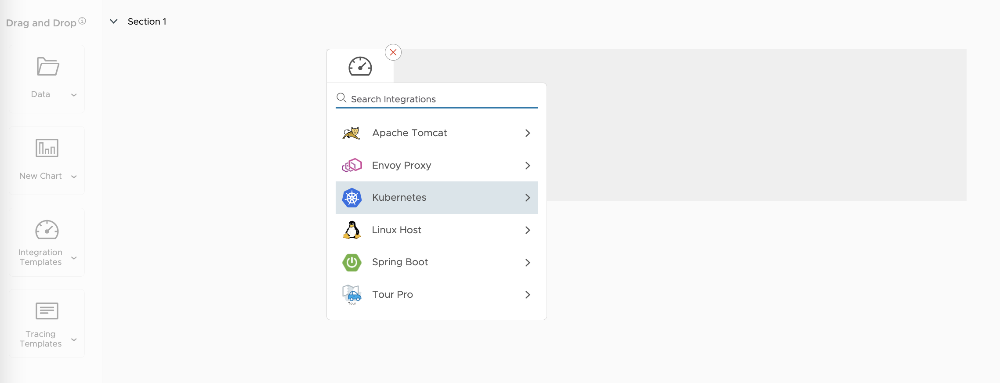

이번 Lab에서는 연동한 Kubernetes Cluster 기반으로 새로운 대시보드와 차트를 생성해 보겠습니다.  

### 1. Integration Template 선택
- 상단 메뉴에서 Dashboard > Create Dashboard로 이동합니다.
- 왼쪽 메뉴에서 Integration Template > Kubernetes를 클릭합니다.

### 2. 원하는 항목을 선택해 추가
아래와 같이, 원하는 항목을 선택해 대시보드를 구성합니다.  

예시에서는 Kubernetes Summary 및 Health Check 두가지 섹션을 구성했습니다.  

### 3. 생성한 대시보드 확인
Dashboard > All Dashboard > My Dashboard에서 생성한 대시보드를 확인합니다.  

