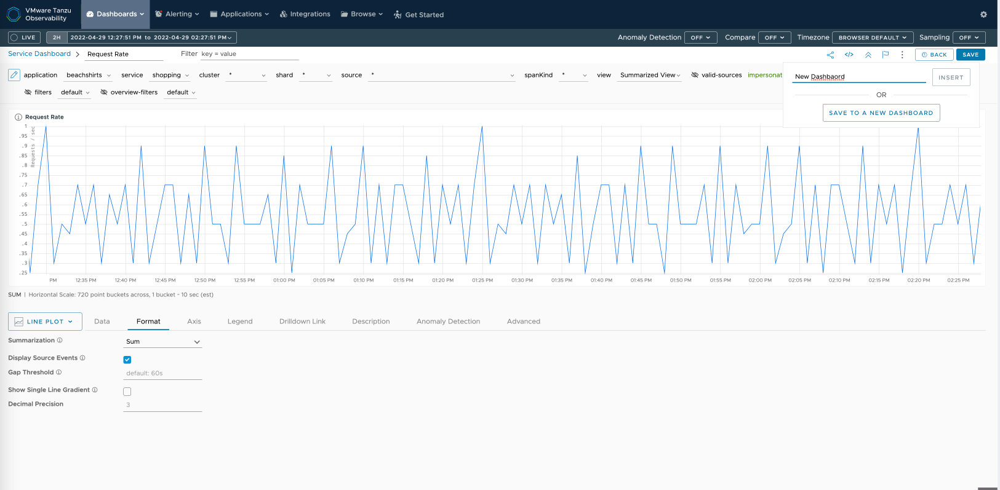

Spring Boot 기반의 애플리케이션에 대한 맵 조회가 가능합니다  
애플리케이션 맵에서 드릴다운해 특정 서비스에 대한 대시보드, Trace 까지 확인할 수 있습니다  

### 1.애플리케이션 맵 조회
상단 메뉴에서 Application > Application Status를 선택합니다  

위 예시와 같이, 애플리케이션 맵을 통해 애플리케이션과 서비스가 연결되는 방식에 대한 개요, 각 서비스에 대한 RED(Request, Error, Duration) 메트릭 및 애플리케이션의 tracing traffic을 볼 수 있습니다. 

서비스를 클릭하면 메트릭 확인이 가능하며, 해당하는 서비스 대시보드 및 Tracing Browser로 이동 및 알람 설정도 가능합니다.

### 2. 서비스 대시보드
서비스 대시보드 메뉴로 접근하면 다음과 같은 화면을 확인 가능합니다.

점 3개를 클릭해 차트 수정, export를 수행합니다. 이번 Lab에서는 대시보드 수정 기능을 통해 새로운 대시보드를 생성해 보겠습니다.

Format 탭에서 몇 가지 설정을 변경했습니다. 우측 상단 Save를 클릭하고, 새로운 대시보드로 저장합니다.

새 대시보드를 저장하면 Dashboard > My Dashboard에서도 확인이 가능합니다.

### 3. 오퍼레이션 대시보드

### 4.Trace 보기

애플리케이션 맵 설정 Lab을 정상적으로 완료하셨습니다.