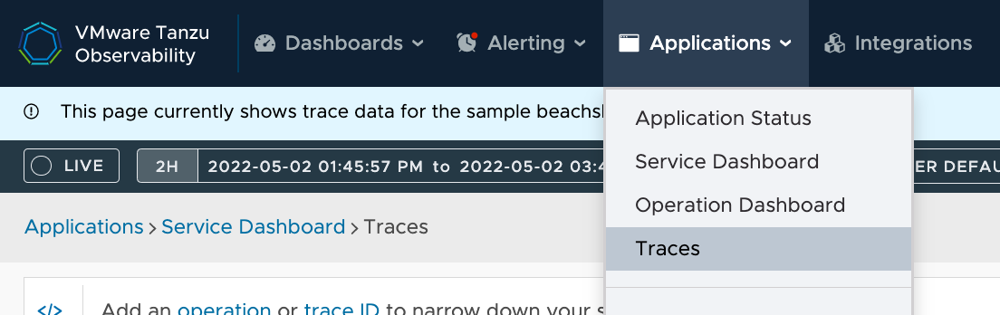
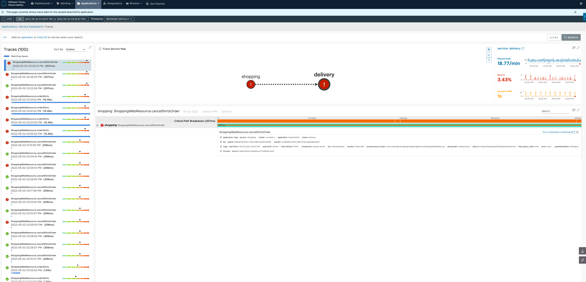
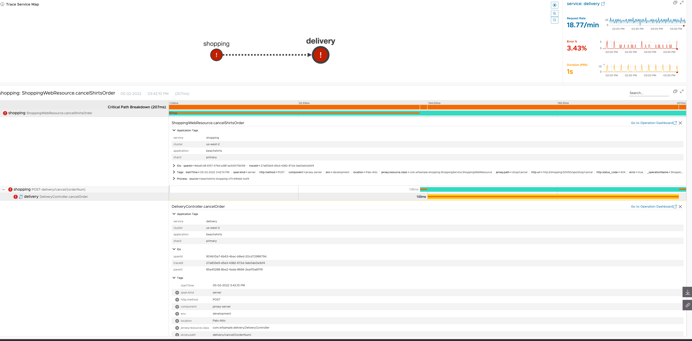
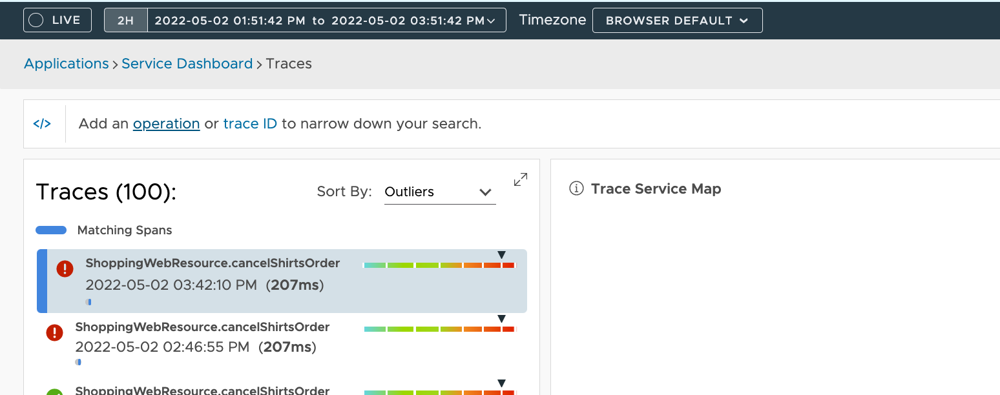
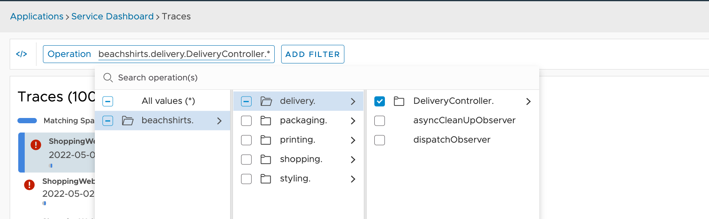
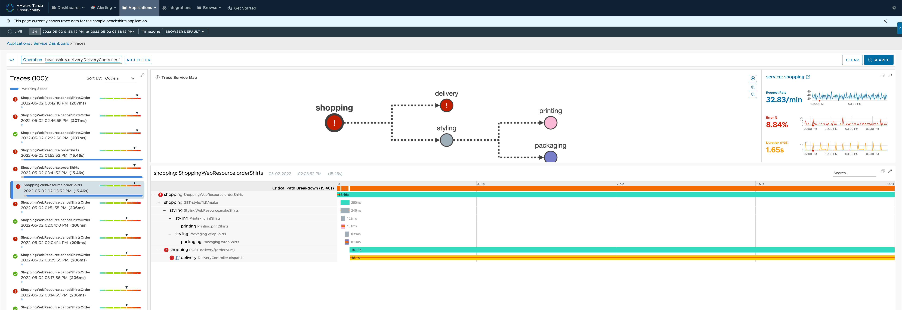

### 1. Tracing 이란?
추적은 분산 애플리케이션에서 한 마이크로서비스에서 다음 마이크로서비스로 요청이 전파되는 방식을 보여줍니다.  
이 다이어그램은 Shopping 서비스의 orderShirts 요청으로 시작하여 Delivery 서비스의 dispatch 요청으로 완료된 특정 요청에 대한 트레이싱 과정을 보여줍니다.

### 2. Distributed Tracing 확인
Application > Trace 메뉴로 접속합니다.

접속 후, 서비스 맵의 Trace를 확인 가능합니다. 왼쪽 탭에서 빨간색 느낌표는 문제가 있는 호출, 초록색 체크는 원활하게 동작하는 호출입니다.  

문제가 있는 첫 번째 trace를 확인해 보겠습니다. 각 요청 옆의 > 버튼을 클릭해 세부정보 보기를 수행합니다.  
또한 막대 그래프를 통해 요청 속도와 원활히 진행되는 여부 파악이 가능합니다.  

좀 더 자세한 정보 확인을 위해 검색 범위를 좁혀 보겠습니다. Operation 이나 Trace ID 를 추가해 검색 범위를 좁힐 수 있는데, 예시에서는 operation을 특정해 보겠습니다. 

Search를 수행하면, 다음과 같이 더 자세한 서비스 맵이 표시됩니다.. 이러한 마이크로서비스 간의 요청 전파 방식을 확인함으로써 문제가 있는 부분을 빠르게 발견할 수 있습니다. 

   

Tracing Lab을 정상적으로 완료하셨습니다.