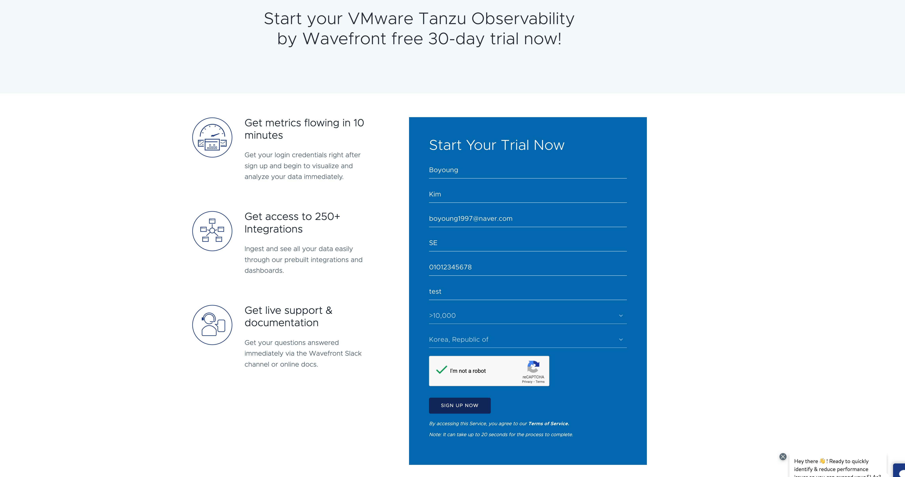
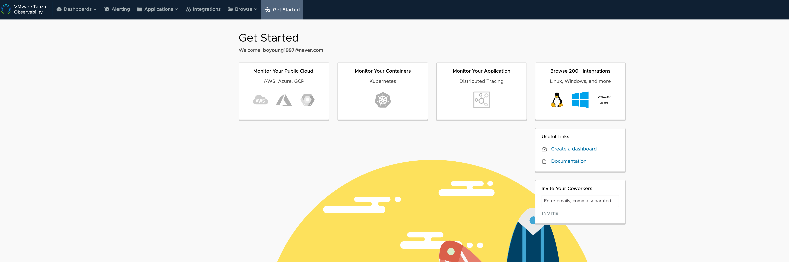

**1. Tanzu Observability 사이트 접속**
다음 사이트 https://tanzu.vmware.com/observability 에 접속해 Start Free Trial 버튼을 클릭합니다. 

**2. Trial 계정을 생성합니다.**  

 정보 입력 후, sign up now를 클릭합니다. 

**3. 로그인 화면으로 이동 후 비밀번호를 세한 뒤 register 합니다.**  

**4. 이제 Tanzu Observability 를 시작하실 수 있습니다!**  

**참고 - Trial 계정 제한**    
- Data Retention은 5일까지 가능합니다    
- 50 Pps => 메트릭   
- 25 sps (spans per second) -> OpenTracing 및 Sleuth 포함    
- 10 dps (distributions per second) => 히스토그램    
- 30일동안 사용 가능   
